# Lab: Git Branching in Visual Studio Code

De ervaring van branching binnen Git brengen we in dit lab naar Visual Studio Code. We werken hier binnen een project waarin de `master` branch als *collaboration branch* is aangewezen. Hier wordt dus de code samengebracht en geïntegreerd die in de diverse *feature branches* is ontwikkeld. Dit is een veelgebruikte aanpak en *best practice* binnen Git.

Wanneer projecten naast versiebeheer ook *Continuous Integration* en *Continuous Deployment* gebruiken, is het vaak zo dat wanneer er nieuwe commits binnenkomen op de *master* branch, er automatisch een deployment getriggerd wordt richting de test-omgeving.

## Stappenplan

### Ophalen van het samenwerkingsrepository

Tot nu toe heeft iedereen in een eigen *repository* gewerkt. We gaan nu samen werken binnen de repository `BITrainer-nl/git-github-workshop`. Je maakt hier een aparte *clone* voor.

1. Open [https://github.com/BITrainer-nl/git-github-workshop](https://github.com/BITrainer-nl/git-github-workshop) in je browser
1. **Clone** de repository
1. Open Visual Studio Code
1. Open via **File** -> **Open** de *map* waarin je de repository ge*clone*d hebt.
1. Blader naar de map `02-git-branching` en bekijk de mappen en bestanden die zich hierin bevinden.

### Doorvoeren van wijzigingen

De standaard-branch die altijd in Git wordt aangemaakt (`master`), is ook hier de standaard-branch. Het idee hierachter is dat dit de centrale plek is, waarin de stabiele versies van alle ontwikkelingen samenkomen (dit wordt vaak de *collaboration branch* genoemd). Wanneer je de code dan met een *clone* ophaalt uit de Git repository, kijk je automatisch naar de meest recente stabiele versie. In Visual Studio Code zie je linksonder ook altijd in welke repository en branch je momenteel aan het werk bent.

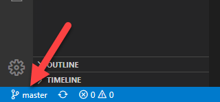

> We gaan enkele wijzigingen aanbrengen in dit project. Naast de internetverkopen (opgevangen in `FactInternetSales`) en de reseller-verkopen (opgevangen in `FactResellerSales`) wil het management meer zicht krijgen op de verkopen aan eigen medewerkers. Vanuit het Data Warehouse-team is daarom besloten een nieuwe Fact daarvoor op te zetten: `FactEmployeeSales`.

6. **Rechtsklik** op de map **src/Tables**
6. Kies **New File**. Geef deze de naam `FactEmployeeSales.sql` en gebruik de volgende definitie:  

```sql
CREATE TABLE [dbo].[FactEmployeeSales] (
    [ProductKey]            INT           NOT NULL,
    [OrderDateKey]          INT           NOT NULL,
    [DueDateKey]            INT           NOT NULL,
    [ShipDateKey]           INT           NOT NULL,
    [EmployeeKey]           INT           NOT NULL,
    [CurrencyKey]           INT           NOT NULL,
    [SalesOrderNumber]      NVARCHAR (20) NOT NULL,
    [SalesOrderLineNumber]  TINYINT       NOT NULL,
    [RevisionNumber]        TINYINT       NOT NULL,
    [OrderQuantity]         SMALLINT      NOT NULL,
    [UnitPrice]             MONEY         NOT NULL,
    [ExtendedAmount]        MONEY         NOT NULL,
    [UnitPriceDiscountPct]  FLOAT (53)    NOT NULL,
    [EmployeeDiscountPct]   FLOAT (53)    NOT NULL,
    [DiscountAmount]        FLOAT (53)    NOT NULL,
    [ProductStandardCost]   MONEY         NOT NULL,
    [TotalProductCost]      MONEY         NOT NULL,
    [SalesAmount]           MONEY         NOT NULL,
    [TaxAmt]                MONEY         NOT NULL,
    [Freight]               MONEY         NOT NULL,
    [CarrierTrackingNumber] NVARCHAR (25) NULL
);

```

8. Sla het bestand op
8. Ga naar **Source Control**
8. Voer een *commit* door voor de bovenstaande wijziging.

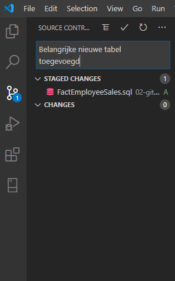

We hebben nu een wijziging gemaakt in onze **lokale** branch `master`. Om deze naar onze *blessed repo* op GitHub te brengen, moeten we nog een *push* doen (of een *sync* binnen Visual Studio Code). Dit blijkt echter niet te mogen:

11. Probeer de wijzigingen te synchroniseren naar GitHub.

Je krijgt waarschijnlijk de volgende foutmelding:

> Can't push refs to remote. Try running 'Pull' first to integrate your changes.

Wanneer je vervolgens op de knop **Open Git Log** klikt, dan zie je daar een tekst met min of meer de volgende strekking:

```
> git pull --tags origin master
From https://github.com/BITrainer-nl/git-github-workshop
 * branch            master     -> FETCH_HEAD
> git push origin master:master
> git ls-files --stage -- C:\src\git-github-workshop\02-git-branching\src\Tables\NieuweTabel.sql
> git cat-file -s e69de29bb2d1d6434b8b29ae775ad8c2e48c5391
> git show :02-git-branching/src/Tables/NieuweTabel.sql
remote: error: GH006: Protected branch update failed for refs/heads/master.        
remote: error: At least 1 approving review is required by reviewers with write access.        
To https://github.com/BITrainer-nl/git-github-workshop.git
 ! [remote rejected] master -> master (protected branch hook declined)
error: failed to push some refs to 'https://github.com/BITrainer-nl/git-github-workshop.git'
```

## Feature branches

Binnen deze GitHub-repository is de `master` branch *protected*. Dit is een stukje inrichting om te bewaken dat `master`, die meestal wordt gebruikt als *collaboration branch*, stabiel blijft. Omwille van de stabiliteit is het onwenselijk dat iedereen de tussentijdse commits hierheen *pusht*. Binnen GitHub heten dit **Branch Protection Rules**.

De gedachte hierachter is dat wijzigingen overal mogen plaats vinden, behalve in de `master`-branch (en eventuele release branches, die alleen "gevoed" worden vanuit `master`). Dit is in GitHub in te stellen via een **branch policy**, die je op de volgende plek kunt terugvinden bij *repositories* waar je eigenaar of *administrator* van bent:

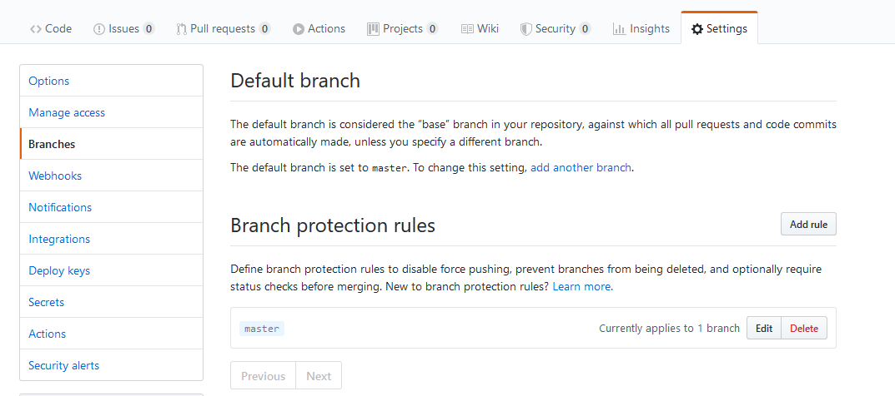

Bij de repo `BITrainer-nl/git-github-workshop` is de **branch protection** als volgt ingericht:

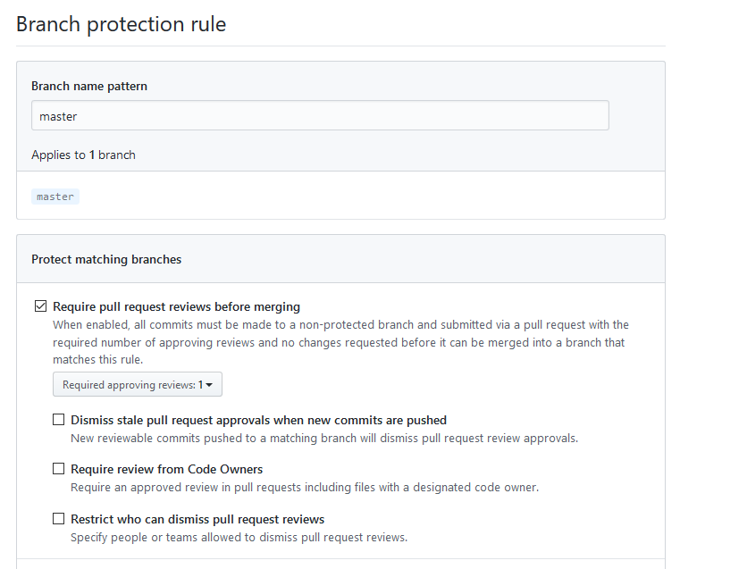

De specifieke Merge Policy die een directe **push** richting een branch blokkeert, is **Require pull request reviews before merging**.

> Wanneer je dit uitprobeert op een eigen repository, is het belangrijk om er rekening mee te houden dat voor jou als beheerder standaard deze beperkingen niet gelden. Om dit goed te kunnen testen, zet je het vinkje **Include administrators** ook aan:
>
> 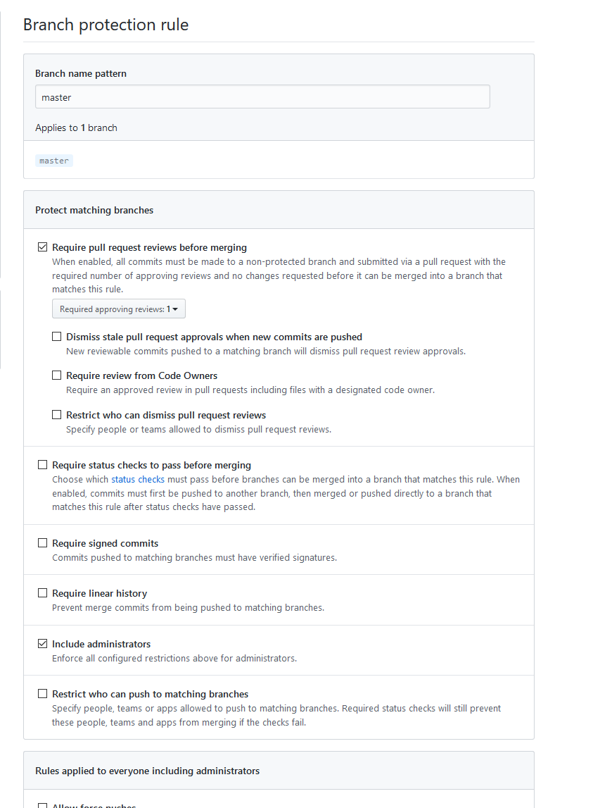

### Wijzigingen onderbrengen in een andere branch

Wanneer we de commit-log zouden opvragen, zou deze er min of meer als volgt uitzien:

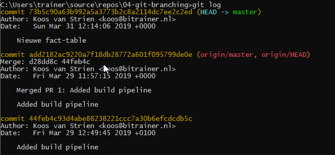

* De lokale HEAD (dus de commit waarmee de working directory vergeleken wordt) staat op de commit met een nieuwe fact-table
* `origin/HEAD` (dus de commit waarnaar GitHub kijkt) staat één commit eerder

Om nu de lokale wijzigingen door te kunnen voeren binnen Azure gaan we de volgende drie stappen doen:

* We maken de (lokale) commit ongedaan op `master`
* We maken een nieuwe branch aan vanaf `master`
  * Dit wordt onze **feature branch**, waarin we de *feature* van de nieuwe fact table ontwikkelen
* We voeren de nieuwe wijzigingen door binnen de *feature branch*
* We doen een *push* van de nieuwe *feature branch*

Nadat de ontwikkelingen op de *feature branch* voltooid zijn, zullen we deze vervolgens samenvoegen met de `master` branch. Dit doen we met behulp van een zogenaamd **pull request**.

#### Wijzigingen ongedaan maken in master

We hebben wijzigingen lokaal doorgevoerd, maar per abuis hebben we dit op de **master** branch gedaan. Daarom kunnen we geen **push** doen richting de *blessed repository*. We gaan daarom eerst de wijzigingen ongedaan maken:

12. Open **GitHub Desktop**
12. Controleer onder **Current repository** of je naar de juiste repository kijkt (`BITrainer-nl/git-github-workshop`)
12. Bekijk de tab **History**. Je ziet één commit met een zwarte pijl ernaast. Dit is een commit die je al wel lokaal hebt, maar nog niet *remote* bekend is:
    * 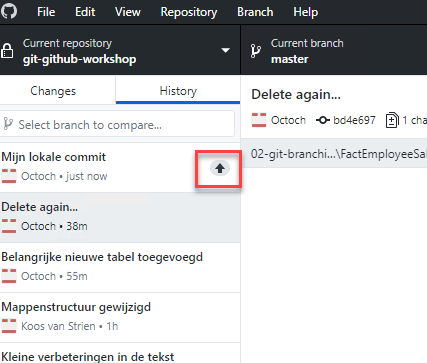
12. Schakel aan de linkerzijde van het scherm naar de tab **Changes**
12. Onderaan heb je nu een knop **Undo**. Hiermee kun je een *commit* ongedaan maken.
12. Schakel aan de linkerzijde van je scherm naar de tab **History**. Controleer dat er nu geen *commits* meer zijn met een zwarte pijl (met andere woorden: die lokaal wel bestaan, maar remote niet)

De lokale `master` branch is nu weer identiek aan de branch op GitHub, `origin/master`. De wijzigingen die je in deze *commit* had opgenomen, zijn teruggezet in je *working directory* en staan dus niet meer in versiebeheer!

#### Aanmaken nieuwe branch

18. Klik binnen GitHub Desktop op **Current branch**
18. Klik **New Branch**
18. Geef deze de naam **feature-fact-employeesales**
18. Klik **Create Branch**

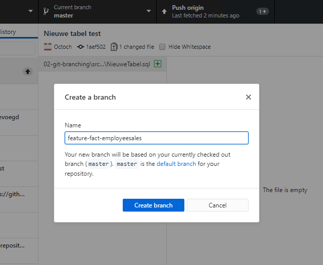

Je krijgt nu van GitHub de vraag wat je met de lokale wijzigingen moet doen. Het nieuw toegevoegde bestand staat namelijk nog steeds in je *working directory*. Je hebt twee keuzes:

* **Leave my changes on master** zorgt voor een *stash*. Feitelijk zet je je wijzigingen dan nog niet in versiebeheer, maar zet je ze even apart zodat je er later mee verder kunt werken.
* **Bring my changes to feature-fact-employeesales** laat je wijzigingen in je *working directory* staan. Wanneer je dan een *stage* en/of *commit* doorvoert binnen je nieuwe branch, komen de wijzigingen in de commit mee.

Nadat de *branch* `feature-fact-employeesales` is aangemaakt, doet GitHub Desktop ook direct een `checkout` van de branch. Je werkt dus per direct in de nieuwe branch.

22. Kies voor **Bring my changes to feature-fact-employeesales** en kies **Switch branch**

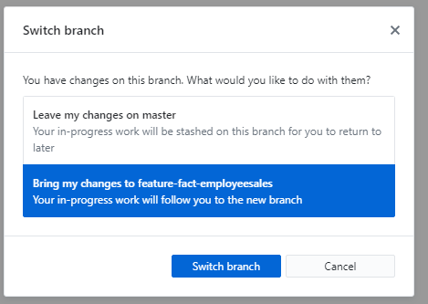

#### Push van de nieuwe branch naar Azure DevOps

De branch `feature-fact-employeesales` bestaat nu alleen nog lokaal. Om deze naar Azure DevOps te brengen, moeten we nog een **push** doen. Zorg er bij de volgende stappen voor dat je op de zojuist aangemaakte *feature branch* aan het werk bent!

23. Maak een nieuwe **commit** binnen GitHub Desktop voor je wijzigingen binnen `feature-fact-employeesales`
23. Klik in de titelbalk op **Publish branch**. Hiermee wordt de *branch* naar GitHub gepusht.

### Hotfix!

De ontwikkeling op de branch `feature-fact-employeesales` is nog niet voltooid, maar er komt een spoedgeval tussendoor: in een poging geld te besparen is de oplossing recent verplaatst van SQL Datawarehouse naar SQL Database. Het leek dat dit goed ging, maar het blijkt dat in de tabeldefinities nog hints stonden over hoe de data opgeslagen moest worden waar SQL Database niet mee weet om te gaan.

Als devops-team besloten om de fix hiervoor (het verwijderen van de *CLUSTERED COLUMNSTORE INDEX hints*) op de standaard-manier op te lossen: een zeer kortlevende feature branch voor de hotfix. Daar zitten de volgende stappen in:

* Branch aanmaken voor de hotfix
* Hotfix bouwen (incl. commit)
* Branch samenvoegen met `master` met behulp van een *pull request*

#### Hotfix ontwikkelen

Hieronder staat het globale stappenplan. Mocht je in meer detail willen weten hoe je branches aanmaakt (of schakelt tussen branches) in Visual Studio, dan is dat hierboven te vinden.

25. Schakel terug naar de **master** branch, en maak een nieuwe branch genaamd `hotfix-cci` aan. Zorg ervoor dat je ook op deze branch werkt.
25. Verander de volgende tabellen. Verwijder de distributie-informatie (`WITH (CLUSTERED COLUMNSTORE INDEX, ...)`).
    * `FactCallCenter`
    * `FactCurrencyRate`
    * `FactFinance`
    * `FactInternetSales`
    * `FactInternetSalesReason`
    * `FactResellerSales`
    * `FactSalesQuota`
    * `FactSurveyResponse`
25. Commit en push deze branch, zodat deze ook in GitHub beschikbaar komt.

### Pull Request

We hebben nu een branch (`hotfix-cci`) aangemaakt en hier code in staan die we graag willen integreren richting de `master` branch. De standaard-manier om een branch te integreren met een andere branch is met behulp van een zogenaamd *pull request*.

26. Open de webbrowser, en browse naar [https://github.com/BITrainer-nl/git-github-workshop](https://github.com/BITrainer-nl/git-github-workshop)
26. Schakel naar de tab **Pull Requests**

GitHub laat je nu direct zien welke pull requests er momenteel actief zijn. Ook krijg je de melding dat je `hotfix-cci` kortgeleden bijgewerkt hebt, en of je hier wellicht een *pull request* mee wilt openen.

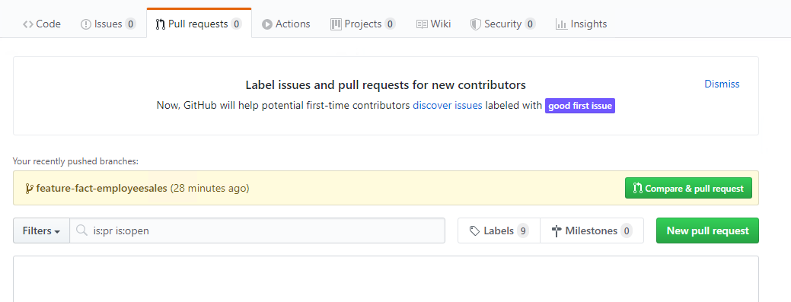

28. We gebruiken voor nu niet de *shortcut* (die je op meerdere plekken binnen GitHub zult tegenkomen). Klik in plaats daarvan op de groene knop **New pull request**
28. Maak een *Pull Request* aan
    * **`hotfix-cci`** into `master`
    * Title & description zijn overgenomen van de laatste commit. Als je deze zinnig hebt ingevuld hoef je hier dus niets aan te veranderen
    * Merk op dat je expliciet *reviewers* en *work items* kunt toevoegen om je Pull Request context te geven
    * Klik **Create**

Je *Pull Request* wordt nu geopend. Je krijgt nu een tijdslijn te zien waarin al het werk aan deze PR chronologisch wordt weergegeven:

* Opmerkingen van *reviewers*
* Blokkades

Vraag aan iemand anders binnen de training om een *review* te doen. Hiervoor opent hij/zij de PR, en kiest voor **Add your review**. Kies bij het toevoegen van een *review* vervolgens voor **Approve**. Dit zorgt ervoor dat de Pull Request automatisch doorgang kan vinden.

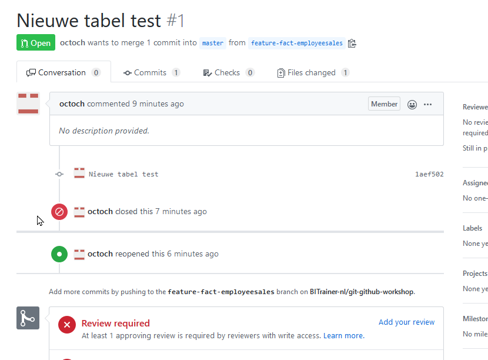

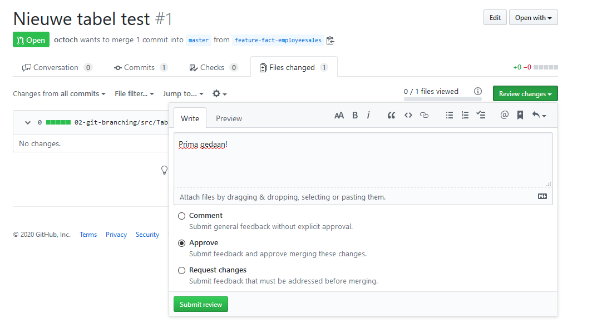

30. Nadat er een positieve review is gegeven, wordt de knop **Merge pull request** groen. Klik hierop om de Pull Request door te zetten.

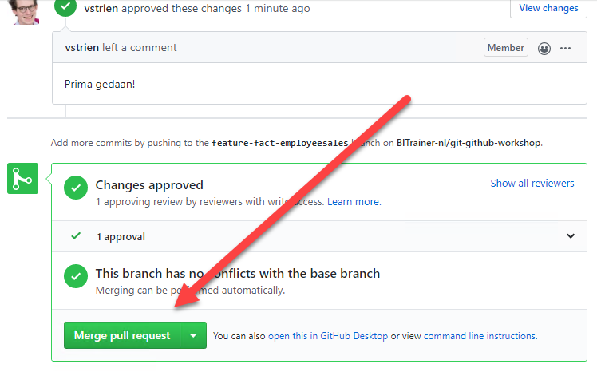

31. Laat alle instellingen voor wat het is, en klik op **Confirm merge**. De Pull Request wordt nu doorgevoerd, en de wijzigingen van branch `hotfix-cci` worden doorgevoerd binnen de *collaboration* branch `master`.

Je krijgt ook direct de mogelijkheid om de branch te *verwijderen*. We gaan er later nog op in waarom je dit wel of niet zou doen, maar voor nu kiezen we ervoor om de branch - zoals voorgesteld - te verwijderen.

32. Klik **Delete branch**


## Afronding

Inmiddels is de nieuwe fact table `FactEmployeeSales` ook uitvoerig getest, en kan deze geïntegreerd worden met `master`. Doe dit opnieuw met behulp van een *pull request*

> In deze oefening heb je gezien hoe je met `feature branches` kortlevende branches gebruikt voor je ontwikkelingen. De wijzigingen die klaar stonden gedurende de ontwikkeling aan nieuwe *features* stonden bestaande doorontwikkeling of beheersmatige aanpassingen binnen de stabiele basis niet in de weg.
>
> In dit geval konden de twee *pull requests* (vanaf nu: PR's) achtereenvolgens uitgevoerd worden op `master`. Dit kon alleen doordat er geen conflicterende wijzigingen waren tussen `hotfix-cci` en `feature-fact-employeesales`.
>
> Wanneer je langer werkt aan een *feature branch* is de kans groot dat `master` inmiddels veranderd is. Je moet dan de *merge* eerst de andere kant op doen: de laatste versie van *master* wil je dan richting je *feature branch* brengen. Als die merge heeft plaatsgevonden kun je eenvoudig een PR van je *feature branch* naar `master` doen.
